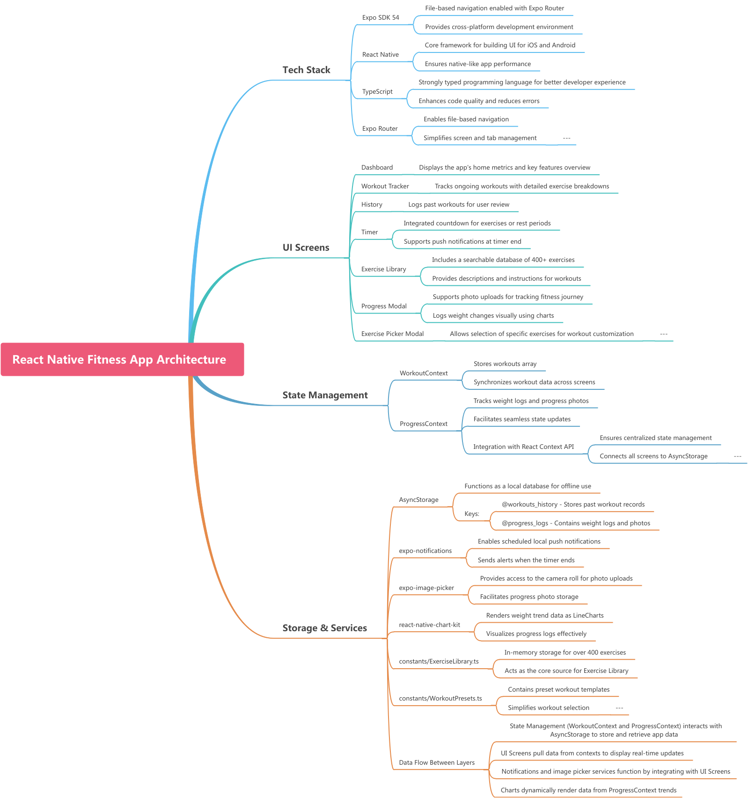

# 💪 FitnessApp

A **comprehensive, fully offline React Native fitness application** built with Expo SDK 54. Track workouts, monitor personal progress, use interval timers with lock-screen notifications, and explore a library of 400+ exercises — all stored locally on your device with zero cloud dependency.

---

## 🏗️ Architecture Diagram



The app is organized into 4 layers:
- **Tech Stack** — Expo, React Native, TypeScript, Expo Router
- **UI Screens** — 5 tabs + 2 modal screens
- **State Management** — React Context API (WorkoutContext + ProgressContext)
- **Storage & Services** — AsyncStorage (local DB), expo-notifications, expo-image-picker, react-native-chart-kit

---

## ✨ Features

| Feature | Description |
|---|---|
| 📊 Dashboard | Live widgets showing recent workouts, streak, exercise count, and progress |
| 🏋️ Workout Tracker | Log exercises, sets, reps, and weight with preset workout templates |
| 📅 Workout History | Browse all past workouts with preset badges and exercise breakdowns |
| ⏱️ Multi-Mode Timer | Stopwatch, Countdown, Tabata, EMOM — with lock-screen push notifications |
| 📚 Exercise Library | 400+ exercises with muscle groups, benefits, and instructions |
| 📈 Personal Progress | Auto-derived strength stats, body weight chart, and progress photos |

---

## 🔧 Tech Stack

| Technology | Purpose |
|---|---|
| **Expo SDK 54** | Cross-platform mobile framework |
| **React Native** | Core UI rendering for iOS & Android |
| **TypeScript** | Type safety across the entire codebase |
| **Expo Router** | File-based navigation with Bottom Tabs |
| **AsyncStorage** | Local on-device database (no backend required) |
| **expo-notifications** | Scheduled push notifications for timer end (works on lock screen) |
| **expo-image-picker** | Camera roll access for progress photo uploads |
| **expo-linear-gradient** | Gradient overlays on cards and charts |
| **react-native-chart-kit** | LineChart for body weight trend visualization |

---

## 📁 Project Structure

```
FitnessApp/
├── app/
│   ├── (tabs)/
│   │   ├── index.tsx          # Dashboard
│   │   ├── track.tsx          # Workout Tracker
│   │   ├── history.tsx        # Workout History
│   │   ├── timer.tsx          # Multi-mode Timer
│   │   └── exercises.tsx      # Exercise Library
│   ├── progress.tsx           # Personal Progress (modal)
│   └── _layout.tsx            # Root layout + providers
├── components/
│   ├── DashboardWidget.tsx
│   ├── ExerciseCard.tsx
│   ├── ExerciseSelectionModal.tsx
│   └── SetRow.tsx
├── constants/
│   ├── Colors.ts              # Dark/light theme tokens
│   ├── ExerciseLibrary.ts     # 400+ exercise definitions
│   ├── WorkoutPresets.ts      # Preset workout templates
│   └── types.ts               # Shared TypeScript interfaces
└── context/
    ├── WorkoutContext.tsx     # Workout state + AsyncStorage
    └── ProgressContext.tsx    # Progress logs + AsyncStorage
```

---

## 🚀 How to Run

### Prerequisites
- Node.js 18+
- Expo CLI (`npm install -g expo-cli`)
- Expo Go app on your phone **or** an Android/iOS emulator

### 1. Clone the Repository

```bash
git clone https://github.com/MuskanKarodiya/Fitness-App.git
cd Fitness-App
```

### 2. Install Dependencies

```bash
npm install
```

### 3. Start the Development Server

```bash
npx expo start
```

### 4. Open on Your Device

| Option | How |
|---|---|
| **Physical phone** | Scan the QR code with the Expo Go app (iOS / Android) |
| **Android Emulator** | Press `a` in the terminal |
| **iOS Simulator** | Press `i` in the terminal (macOS only) |

---

## 🗄️ Data Storage

All data is stored **locally on your device** using `@react-native-async-storage`:

| Key | Contents |
|---|---|
| `@workouts_history` | Array of all logged workout sessions |
| `@progress_logs` | Array of body weight check-ins and progress photo URIs |

> No internet connection or account required. Your data never leaves your phone.

---

## 🔔 Background Timer

The timer uses `expo-notifications` to schedule a **local push notification** when you start a countdown, Tabata, or EMOM session. This means:
- The notification fires **even if your screen is locked**
- When you unlock, the timer display **auto-resyncs** from the exact end timestamp
- Pausing or resetting the timer **cancels** the pending notification

---

## 🎨 Design

- **Dark theme** — Deep black (`#0a0a0a`) base with **purple accent** (`#7F57F2`)
- Glassmorphism cards, smooth gradients, and micro-animations
- Premium typography and icon-driven UI throughout

---

*Built with ❤️ using Expo + React Native*
